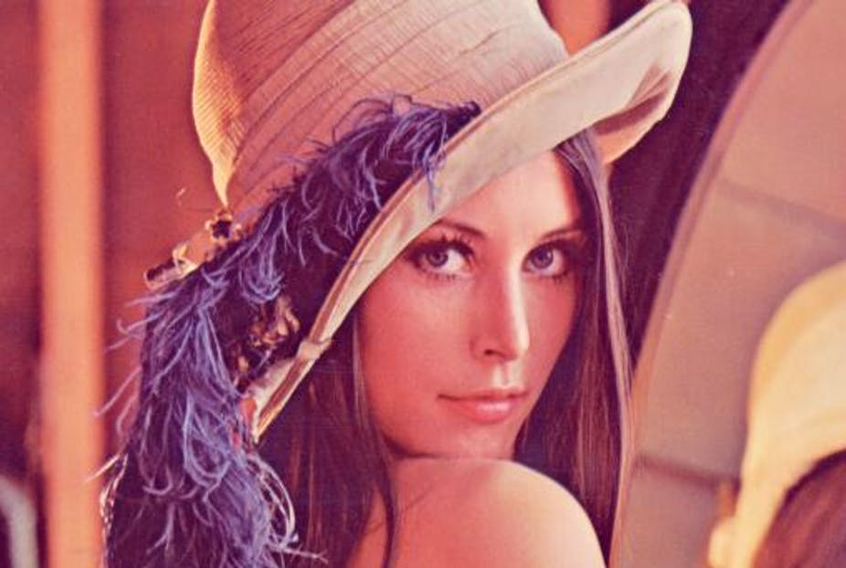
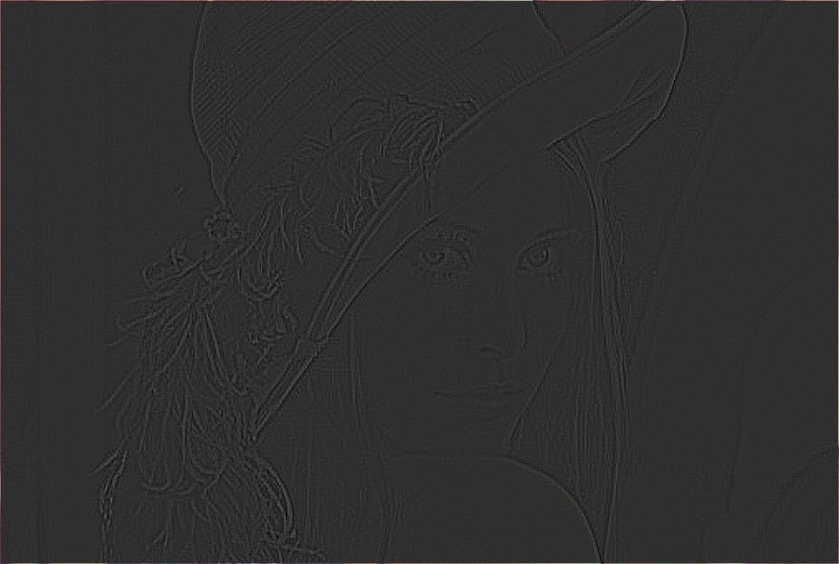
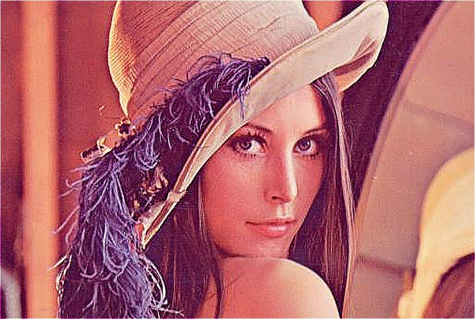
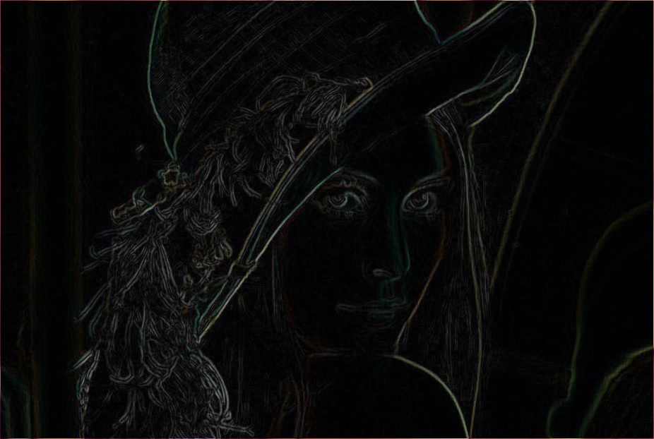
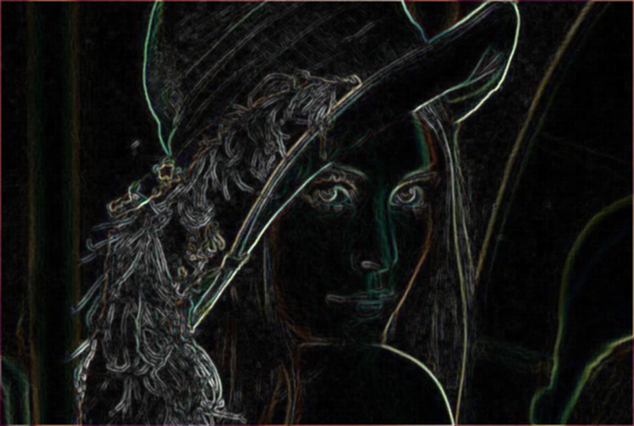
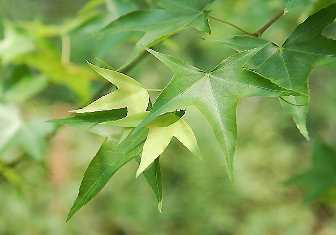
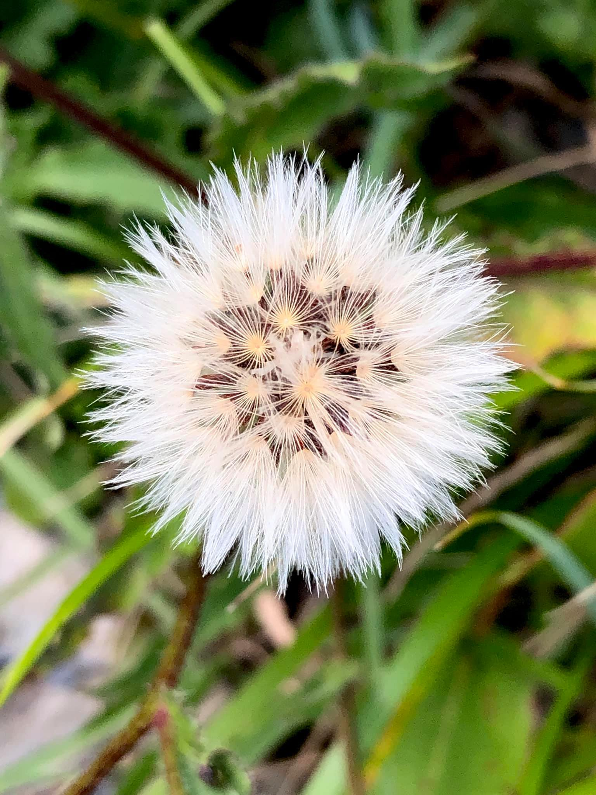
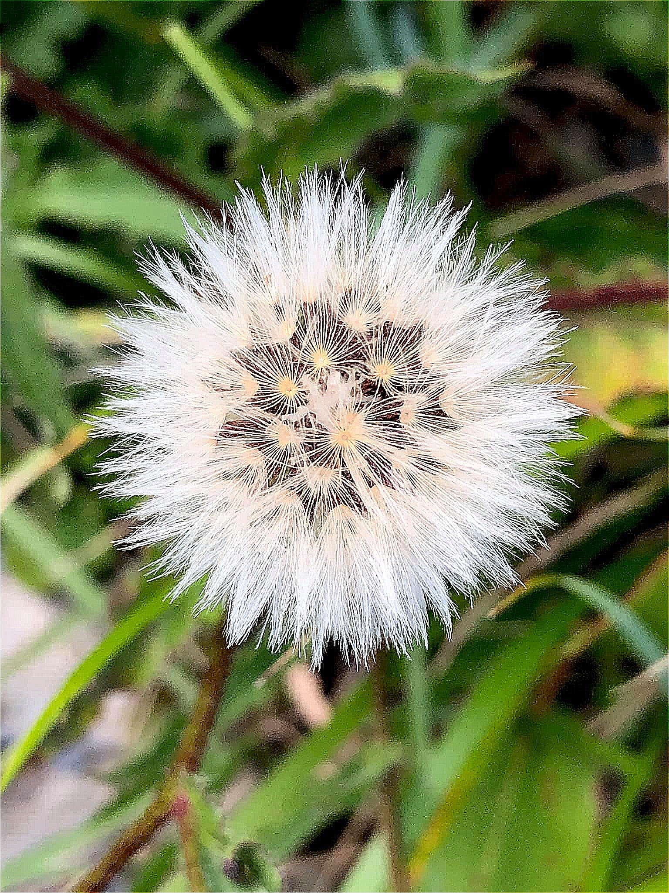
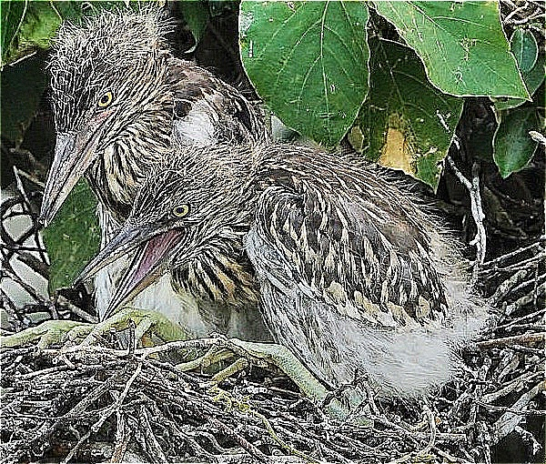
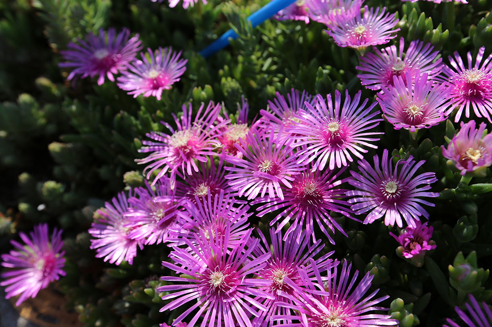

# Image Sharpening - 影像銳化
> 本文與程式上傳至GitHub，連結 QR Code


## 影像微分

  * ### 影像的座標系不是連續，x軸座標 0, 1, 2, ..., x-1, x, x+1, ...，遞增 1。

  * ### 單一變數，一階微分定義
    *  

  * ### 單一變數，二階微分定義
    *  

  * ### 影像可表示為 x, y 軸兩變數的函數，f(x, y)為座標 (x, y) 的 intensity
    * #### 影像的二階微分定義，為在 f 分別對 x 及 y 進行兩次偏微分，然後加總。根據上式(二次微分)，得到
      * x 方向，

      * y 方向，

      * 上兩式加總，得

        

  * ### Laplacian Kernel
    * 上式影像二次微分，可以透過使用 Laplacian Kernel 進行 Convolution 達成。

    * > Laplacian Kernel
      

    * > Laplacian Kernel 擴展形式
       

---

## 銳化 <版本一>：


 **即 銳化 = 原圖 + (原圖與 Laplacian Kernel 擴展形式的 Convolution 運算)**

 **原圖**  

 **原圖經過 Laplacian Convolution得到下圖**    

 **銳化 <版本一>**  

 ### 缺點∶是銳化了，但也製造出很多雜訊!
 
---

## 銳化 <版本二>： Sobel
  * #### 銳化，但不要有雜訊。只銳化 edge 的地方，如果原本平坦的地方，有發生二階微分較高的情形，將它抹去。
  * #### 方法:
    * #### step 1) 原圖經過 Sobel Kernel 找 Edge。
    * #### step 2) Edge 經過 Average Kernel 模糊化。
    * #### step 3) 模糊化後的 Edge，標準化到 0~1 之間。
    * #### step 4) 原圖 + Lapacian * Step3。

  * #### Step 1
    * #### 原圖分別計算水平、垂直 Sobel 運算後，加總
    * #### Sobel Kernel
      * ##### Horizontal 
         

      * ##### Vertical 
        

    

  * #### Step 2
    * #### 將 Step 1 Edge 模糊化。對 Step 1 以 Average Kernel 進行 Convolution 運算。
    * #### Average Kernel
      

    

  * #### Step 3
    * #### 將 Step 2 模糊化後的 Edge，標準化到 0~1 之間。
    * #### 使用 OpenCV 提供的 Normalization 函式
```python    
    step_3 = cv2.normalize(step_2_blur, None, 0, 1, cv2.NORM_MINMAX)    
```

  * #### Step 4
    * #### 原圖 + Lapacian * Step 3
    * #### Laplacian * Step 3 有助於將雜訊去除，只留下 edge 處要進行銳化。

    * #### 銳化效果版本二。對比原圖，細節被加強，且沒有版本一嚴重的雜訊。
    

    * #### 原圖
    

## 其他照片銳化效果比較
| | 20070401_121.jpg |
|-|-|
| 原圖 |   | 
| 銳化<br/>版本一 |  | 
| 銳化<br/>版本二 |  |

| | flower_1.jpg |
|-|-|
| 原圖 |   | 
| 銳化<br/>版本一 |  | 
| 銳化<br/>版本二 |  |

| | bird_4_crop.jpg |
|-|-|
| 原圖 |   | 
| 銳化<br/>版本一 |  | 
| 銳化<br/>版本二 |  |


| | IMG_7367_2.jpg |
|-|-|
| 原圖 |   | 
| 銳化<br/>版本一 |  | 
| 銳化<br/>版本二 |  |


