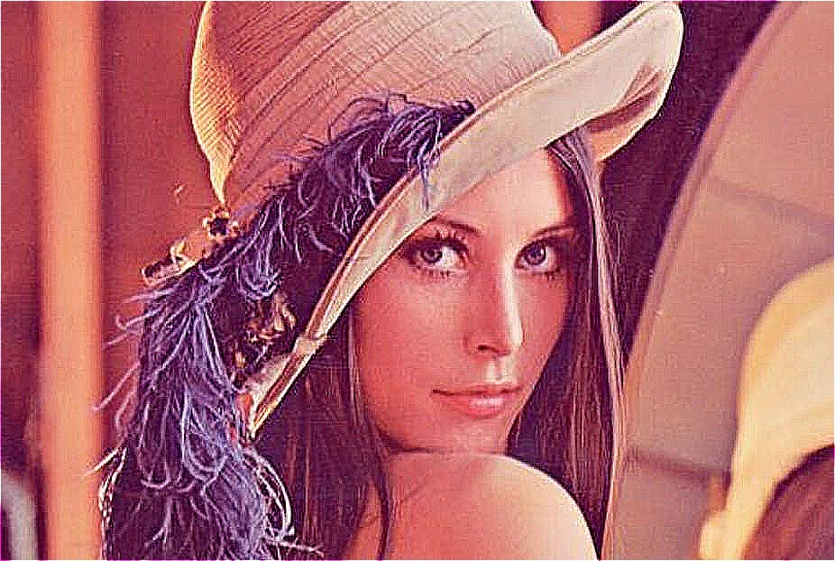

# Image Sharpening - 影像銳化

## 影像微分

  * ### 影像的座標系不是連續，x軸座標 0, 1, 2, ..., x-1, x, x+1, ...，遞增 1。

  * ### 單一變數，一階微分定義
    *  

  * ### 單一變數，二階微分定義
    *  

  * ### 影像可表示為 x, y 軸兩變數的函數，f(x, y)為座標 (x, y) 的 intensity
    * #### 影像的二階微分定義，為在 f 分別對 x 及 y 進行兩次偏微分，然後加總。根據上式(二次微分)，得到
      * x 方向，

      * y 方向，

      * 上兩式加總，得

        

  * ### Laplacian Kernel
    * 上式影像二次微分，可以透過使用 Laplacian Kernel 進行 Convolution 達成。

    * > Laplacian Kernel
      

    * > Laplacian Kernel 擴展形式
       

---

## 銳化 <版本一>：

**銳化 = 原圖 + (原圖與Laplacian Kernel擴展形式的Convolution)**

---

#### Gradient Kernel
##### Horizontal 
 

##### Vritical 

## 銳化效果比較
|原圖|銳化法一|銳化法二(Sobel)|
|-|-|-|
|   |  |  |
|   |  |  |
